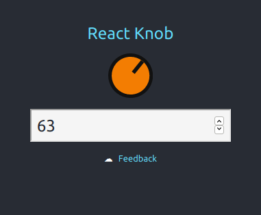

React Knob (WIP)

Based on [io-808-knob-demo](https://codepen.io/vincentriemer/pen/YZVdQb)



Installation:

    $ yarn add @d10221/react-knob
    # or npm i @d10221/react-knob

Usage:

```javascript
// Default Skin
import Knob from "@d10221/react-knob";
const App = () => {
  const [state, setState] = useState({ value: 0 });

  function handleChange(value: number) {
    if (value < 0) return;
    if (value > 100) return;
    setState({ value });
  }
  return (
    <Knob
      value={state.value}
      onChange={handleChange}
      size={65}
      min={0}
      max={100}
      step={1}
      bufferSize={300}
    />
  );
};
```

Or bring your own.  
Note: MyFancyKnob is made by you :)
```xml
<Knob
  value={state.value}
  onChange={handleChange}
  size={65}
  min={0}
  max={100}
  step={1}
  bufferSize={300}
>
  <MyFancyKnob />
</Knob>
```

[Source](./packages/react-knob)

[Demo src](./packages/demo)

[Demo](https://d10221.github.io/react-knob/)
